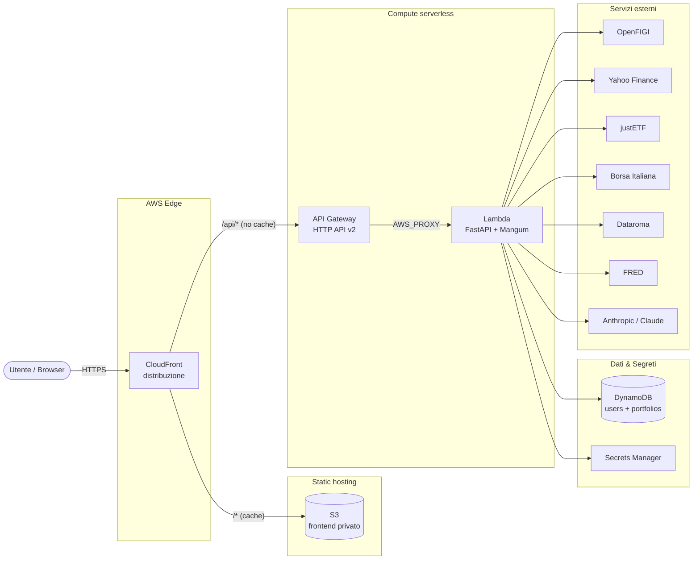

# PortfolioLab — Documentazione

PortfolioLab e' una dashboard web per l'analisi di portafogli di investimento. Permette di:

- cercare strumenti (azioni, ETF, obbligazioni, criptovalute) per ISIN o ticker, con quotazioni
  delle obbligazioni da Borsa Italiana e rischio sovrano da FRED;
- costruire un portafoglio (in % o in euro), importarlo da PDF tramite AI (Claude) e salvarlo su cloud;
- ottenere asset allocation, esposizione geografica e valutaria, TER, P&L e performance;
- confrontarlo con i portafogli dei superinvestitori (dati 13F da Dataroma);
- fare un'**analisi approfondita** (pagina `/analisi`): TWR e MWR, contributo al rendimento,
  look-through di ETF e fondi, obbligazioni, costi, rischio, correlazioni, frontiera efficiente,
  Monte Carlo e confronto con allocazioni alternative.

Stack: **FastAPI** (backend, eseguito su AWS Lambda via Mangum) + **frontend statico** (HTML/JS
vanilla servito da S3/CloudFront) + **DynamoDB** (persistenza) + **Terraform** (infrastruttura AWS).

## Indice della documentazione

| Pagina | Contenuto |
| --- | --- |
| [Architettura](architettura.md) | Diagramma dei componenti, flussi di dati, deploy serverless |
| [Backend / API](backend.md) | Moduli, endpoint FastAPI, modelli pydantic, input/output, funzioni interne |
| [Analisi approfondita](analisi.md) | Metodologia e formule di `/api/analysis/*` (TWR, MWR, rischio, look-through, obbligazioni) |
| [Database](database.md) | Schema DynamoDB, funzioni di accesso dati |
| [Frontend](frontend.md) | Pagine, stato client, flussi di interazione, grafici, chiamate API |
| [Infrastruttura (Terraform)](infrastruttura.md) | Risorse AWS, relazioni, IAM, deploy |
| [Test](testing.md) | Suite pytest offline, fixture HTML reali, test `live`, come aggiungerne |
| [Riferimenti / Glossario](riferimenti.md) | Servizi esterni, variabili d'ambiente, tooling, glossario finanziario |

## Componenti del sistema



Per i dettagli dei singoli pezzi vedi [Architettura](architettura.md).

## Avvio rapido (locale)

```bash
uv sync
uv run uvicorn backend.main:app --reload
# Apre http://localhost:8000 (serve anche il frontend da ./frontend, compresa /analisi)
```

Variabili d'ambiente principali (in locale via `.env`): `ANTHROPIC_API_KEY`, `SECRET_KEY`,
`AWS_REGION`, `DYNAMODB_TABLE`, `DYNAMODB_PORTFOLIOS_TABLE`, `FRED_API_KEY` (opzionale).
Vedi [Riferimenti](riferimenti.md).

## Test

```bash
uv run pytest            # suite offline (~300 test, pochi secondi)
uv run pytest -m live    # verifica gli scraper sui siti reali
```

Dettagli in [Test](testing.md).

## Deploy su AWS

```powershell
.\deploy.ps1 first-deploy   # prima installazione completa
.\deploy.ps1 deploy         # aggiornamenti successivi (image + static)
```

Dettagli nella pagina [Infrastruttura](infrastruttura.md).
