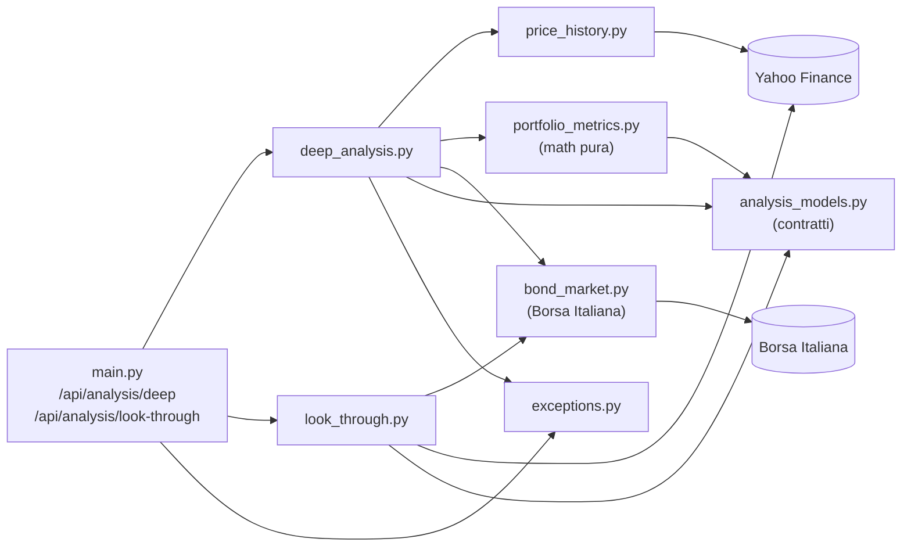
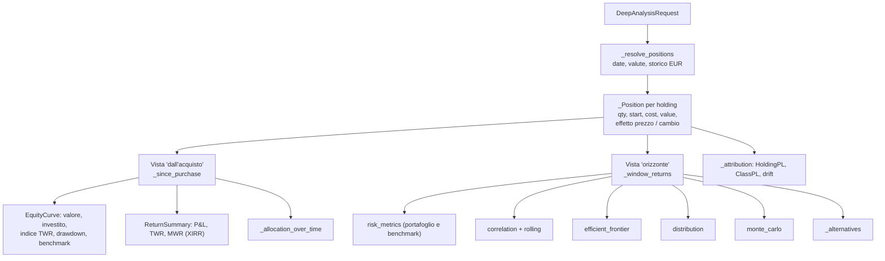

# Analisi approfondita — metodologia

[← Indice](README.md) · Correlati: [Backend](backend.md) · [Frontend](frontend.md) · [Test](testing.md) · [Riferimenti](riferimenti.md)

## Riassunto

La pagina `/analisi` produce un'analisi completa del portafoglio a partire da due endpoint:

- `POST /api/analysis/deep` — rendimento dall'acquisto (TWR/MWR), P&L e contributo per asset
  class, effetto prezzo vs effetto cambio, allocazione nel tempo e drift, metriche di rischio,
  correlazioni, frontiera efficiente, distribuzione dei rendimenti, Monte Carlo, allocazioni alternative.
- `POST /api/analysis/look-through` — radiografia (X-Ray): asset class, settori, geografia,
  valute, titoli sottostanti e sovrapposizione tra ETF, obbligazioni (duration, rendimento,
  rating), costi (TER).

Entrambi accettano lo stesso contratto `DeepAnalysisRequest`. Il frontend chiama prima `deep`
e poi `look-through`, passando come `amount` il valore in EUR calcolato dalla prima chiamata.

Strumento informativo, non consulenza finanziaria.

## Moduli coinvolti

| Modulo | Responsabilita' | I/O |
| --- | --- | --- |
| `backend/analysis_models.py` | Contratti pydantic di request/response (solo dati) | — |
| `backend/price_history.py` | Storico prezzi giornaliero da Yahoo, convertito in EUR | Yahoo (`yf.download`) |
| `backend/portfolio_metrics.py` | Matematica pura: CAGR, volatilita', Sharpe, Sortino, drawdown, XIRR, correlazioni, frontiera, Monte Carlo | nessuno |
| `backend/deep_analysis.py` | Orchestrazione dell'analisi `deep` | Yahoo, Borsa Italiana (via `bond_market`) |
| `backend/look_through.py` | Orchestrazione del look-through + matematica obbligazionaria | Yahoo (`funds_data`, `info`), Borsa Italiana |
| `backend/exceptions.py` | `InsufficientDataError` → HTTP 422 | — |



## Contratto di input (`DeepAnalysisRequest`)

| Campo | Default | Vincoli | Note |
| --- | --- | --- | --- |
| `holdings[]` | — | non vuoto (altrimenti 400) | `AnalysisHolding`, vedi sotto |
| `liquidita` | 0 | ≥ 0 | EUR |
| `lookback_years` | 3 | 1–10 | orizzonte delle metriche di rischio |
| `risk_free` | 0.02 | 0–0.2 | tasso annuo (frazione) per Sharpe/Sortino/frontiera |
| `benchmark` | `SWDA.MI` | ticker Yahoo | beta, correlazione, curva di confronto |
| `equity_proxy` / `bond_proxy` | `SWDA.MI` / `IEAG.MI` | ticker Yahoo | allocazioni alternative 100/80-20/60-40 |

`AnalysisHolding`: `ticker`, `yf_ticker?`, `isin`, `name`, `category`, `currency?`,
`geography?`, `ter?`, `allocation`, `amount?` (EUR), `quantity?`, `purchase_price?` (nella valuta
dello strumento; obbligazioni in % del nominale), `purchase_date?` (`YYYY-MM-DD`, `DD/MM/YYYY`, `DD-MM-YYYY`).

Se nessun holding ha `amount` o `quantity` (portafoglio solo in %), gli importi sono **nozionali
su 10.000 €** e la risposta ha `notional: true`. Il frontend in modalita' % converte gia' le
percentuali in importi nozionali.

## Pipeline di `/api/analysis/deep`



### Due viste, scelte di proposito

| Vista | Cosa rappresenta | Usata per |
| --- | --- | --- |
| **Dall'acquisto** | Le posizioni reali, ognuna dalla propria data di acquisto | Quanto hai guadagnato: valore vs investito, TWR, MWR, P&L, drift |
| **Orizzonte** (`lookback_years`) | I **pesi attuali** mantenuti costanti (ribilanciamento giornaliero) sugli ultimi N anni | Metriche di rischio che richiedono uno storico lungo e uniforme |

La liquidita' entra in entrambe con rendimento zero (riduce la volatilita').

### Risoluzione delle posizioni

- **Valuta**: `holding.currency`; se manca viene letta da Yahoo (`fast_info.currency`).
  Le quotazioni in unita' minori (`GBp`, `GBX`, `ZAc`, `ILA`) sono divise per 100.
- **Storico**: una sola chiamata `yf.download` per strumenti, benchmark, proxy e cambi
  `EUR{VAL}=X`; prezzi **rettificati per i dividendi** (`auto_adjust=True`, rendimento totale).
  Weekend eliminati (le crypto vengono allineate ai giorni di borsa).
- **Data di inizio**: `purchase_date`, altrimenti l'inizio dell'orizzonte (`assumed_dates` nella
  risposta, etichetta "data stimata" nella UI). Se lo storico parte dopo, si usa il primo prezzo disponibile.
- **Quantita'**: `quantity`, altrimenti `amount / ultimo prezzo EUR`.
- **Costo**: `quantity × purchase_price / fx₀` se c'e' il prezzo di carico, altrimenti il valore di mercato alla data di inizio.
- **Strumenti senza storico** (obbligazioni singole, ticker falliti): valorizzati una volta sola
  (obbligazioni: `quantity × prezzo Borsa Italiana / 100`), esclusi dalle metriche di rischio e
  dalla curva TWR, inclusi nel P&L. Riportati in `excluded` con la `coverage_pct`.

### Formule

**Effetto prezzo ed effetto cambio** (P = prezzo in valuta locale, fx = unita' di valuta per 1 EUR):

```
costo         = q · P₀ / fx₀
valore        = q · P₁ / fx₁
effetto prezzo = q · (P₁ − P₀) / fx₀
effetto cambio = q · P₁ · (1/fx₁ − 1/fx₀)
effetto prezzo + effetto cambio = valore − costo   (riconciliazione esatta)
```

**TWR (time-weighted return)** — neutralizza tempi e importi dei versamenti:

```
r_t = (V_t − CF_t) / V_{t−1} − 1        CF_t = valore di mercato dei nuovi acquisti al giorno t
TWR = Π (1 + r_t) − 1                   annualizzato solo se il periodo ≥ 365 giorni
```

**MWR (money-weighted, XIRR)** — tasso annuo che azzera il valore attuale dei flussi:

```
Σ CF_i / (1 + r)^((d_i − d_0)/365) = 0
flussi: −costo di ogni posizione alla sua data, −liquidita' all'inizio, +valore attuale oggi
```

Risolto per bisezione in `[−99,99%, 1000%]`. Restituisce `None` se il periodo e' < 30 giorni o se
mancano flussi in entrata/uscita.

**Drawdown** — calcolato sull'indice TWR (non sul valore, che salirebbe con i versamenti):
`DD_t = indice_t / max(indice_≤t) − 1`; il minimo e' il max drawdown.

**Metriche di rischio** (`risk_metrics`, 252 giorni di borsa/anno, rendimenti giornalieri semplici):

| Metrica | Formula |
| --- | --- |
| CAGR | `(Π(1+r))^(252/n) − 1` |
| Volatilita' | `std(r, ddof=1) · √252` |
| Sharpe | `(media(r)·252 − rf) / volatilita'` |
| Sortino | `(media(r)·252 − rf) / (√media(min(r − rf/252, 0)²) · √252)` |
| Calmar | `CAGR / |max drawdown|` |
| Beta / correlazione | `cov(r, b) / var(b)` e `corr(r, b)` su date comuni (min 20 giorni) |
| VaR 95% | `−quantile(r, 5%)` (storico, 1 giorno) |
| CVaR 95% | `−media(r ≤ quantile 5%)` |
| Skew / curtosi | `pandas.skew()` / `pandas.kurt()` (curtosi in eccesso) |

**Correlazione**: matrice sui primi 12 strumenti per peso con almeno l'80% di storico;
correlazione media a coppie su finestra mobile di 63 giorni (≈ un trimestre), campionata ogni 5 giorni.

**Frontiera efficiente**: 5.000 portafogli long-only campionati da due distribuzioni di Dirichlet
(una uniforme, una concentrata sugli angoli) + i portafogli a singolo asset; media e covarianza
storiche annualizzate. La frontiera e' l'inviluppo superiore (rendimento crescente al crescere
della volatilita'). Si evidenziano il portafoglio attuale, quello a minima volatilita' e quello a
massimo Sharpe (i portafogli a varianza nulla non hanno Sharpe definito e finiscono in fondo).

**Monte Carlo**: 2.000 percorsi mensili log-normali su 10 anni, con media e volatilita' dei
log-rendimenti storici; seed fisso (risultati riproducibili). Restituisce i percentili 5/25/50/75/95
e la probabilita' di chiudere sotto il valore iniziale. **Assume che il futuro replichi il passato**:
dopo un periodo forte e' ottimista.

**Allocazioni alternative**: 100% azionario, 80/20 e 60/40 costruite con `equity_proxy` e
`bond_proxy` a pesi costanti (ribilanciamento giornaliero), confrontate con i pesi attuali sullo
stesso periodo. La prima data e' la base: tutte le linee partono da 10.000 € esatti.

**Drift**: target = quota di ogni asset class sul capitale investito; attuale = quota sul valore
corrente; `drift = attuale − target` (p.p.). La UI evidenzia la soglia di ±5 p.p.

## Pipeline di `/api/analysis/look-through`

Per ogni strumento (in parallelo, timeout complessivo 15 s) si costruisce un `InstrumentProfile`:

| Tipo | Fonte | Dati |
| --- | --- | --- |
| ETF | `yf.Ticker(...).funds_data` | `asset_classes`, `sector_weightings`, `top_holdings` (prime 10), `bond_ratings`, `bond_holdings` (duration), `fund_operations` (TER) |
| Azione | `yf.Ticker(...).info` | settore; il titolo stesso come posizione sottostante |
| Obbligazione singola | Borsa Italiana (`fetch_bond_quote`) | scadenza, cedola, prezzo → rendimento a scadenza e duration |
| Fallback (errori/timeout) | categoria dello strumento | 100% nella asset class corrispondente |

Aggregazione pesata per valore in EUR:

- **Asset class, settori** (solo parte azionaria), **geografia** (da `holding.geography`),
  **valute** di negoziazione, quota **hedged** (nome contenente "hedged").
- **Esposizioni sottostanti**: `peso strumento × peso del titolo nello strumento`, sommate per simbolo.
  Un titolo presente in piu' strumenti e' marcato come overlap.
- **Sovrapposizione tra ETF**: `Σ min(peso_A, peso_B)` sui titoli comuni. Yahoo pubblica solo le
  prime 10 posizioni: e' un **limite inferiore**.
- **Obbligazioni**: duration media pesata sulla sola parte obbligazionaria, distribuzione dei rating
  (AAA → below B; `us_government` non e' un rating ed e' escluso).
- **Costi**: `costo annuo = valore × TER`; TER medio ponderato sull'intero portafoglio (le azioni
  pesano con TER zero); costo su 10 anni a valore costante.

### Rendimento e duration di un'obbligazione

`bond_yield_duration(prezzo, cedola, anni, frequenza)`:

1. Flussi: cedole `cedola/frequenza` a intervalli regolari che terminano alla scadenza + rimborso 100.
2. **Prezzo tel quel = prezzo secco + rateo**, con rateo stimato dalla frazione del periodo cedolare
   gia' maturata. Senza il rateo il rendimento risulterebbe sovrastimato poco prima dello stacco cedola.
3. Rendimento a scadenza per bisezione; duration di Macaulay e **duration modificata** =
   `Macaulay / (1 + y/frequenza)`.

La frequenza e' `cedola annua / cedola del periodo`. La pagina MOT di Borsa Italiana riporta solo
la cedola del periodo: in quel caso la duration e' calcolata ma il rendimento a scadenza non viene
mostrato.

## Errori

| Caso | Risposta |
| --- | --- |
| `holdings` vuoto | 400 |
| Parametri fuori range (`lookback_years`, `risk_free`, `liquidita` < 0) | 422 (validazione pydantic) |
| Nessuno strumento con storico, o meno di 30 giorni di rendimenti nell'orizzonte | 422 `InsufficientDataError` con messaggio |
| Yahoo non raggiunge un ETF nel look-through | 200 con profilo di fallback per quello strumento |

## Limiti noti

- I prezzi rettificati includono i dividendi: per un ETF a distribuzione il "valore" include le
  cedole/dividendi come se fossero reinvestiti.
- Obbligazioni singole senza storico giornaliero: fuori da TWR e metriche di rischio.
- Top holdings degli ETF limitate alle prime 10 (overlap sottostimato).
- Il rischio cambio e' misurato sulla valuta di negoziazione, non su quella dei sottostanti.
- Monte Carlo e frontiera si basano su stime storiche, molto rumorose.

## Riferimenti

- [Backend](backend.md) — endpoint e moduli.
- [Frontend](frontend.md) — pagina `/analisi` e grafici.
- [Test](testing.md) — test delle formule e dei casi limite.
- [Riferimenti](riferimenti.md) — glossario (TWR, MWR, duration, ...).
