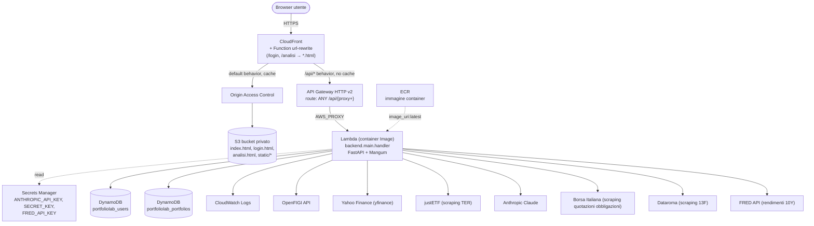
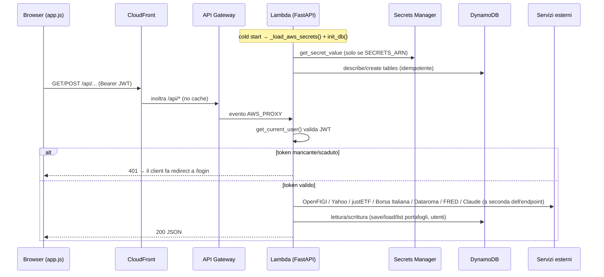
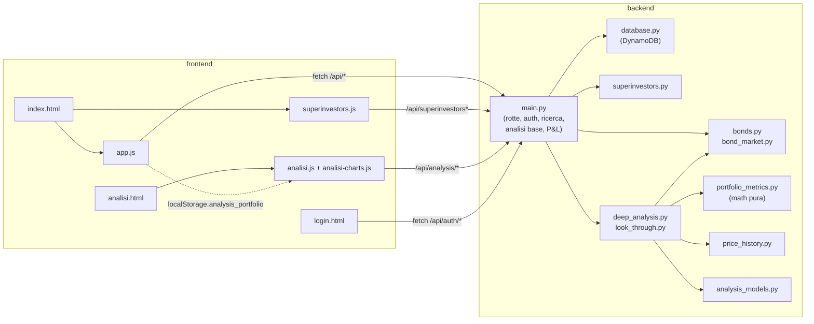

# Architettura

[← Indice](README.md) · Correlati: [Backend](backend.md) · [Analisi](analisi.md) · [Frontend](frontend.md) · [Database](database.md) · [Infrastruttura](infrastruttura.md)

## Riassunto

PortfolioLab e' un'applicazione serverless a tre strati:

1. **Frontend statico** — tre pagine HTML in JS vanilla, nessun build step, grafici con Chart.js (CDN):
   dashboard (`index.html` + `app.js` + `superinvestors.js`), login (`login.html`) e analisi
   approfondita (`analisi.html` + `analisi.js` + `analisi-charts.js`).
2. **Backend FastAPI** — `backend/main.py` (rotte) piu' moduli dedicati per obbligazioni
   (`bonds.py`, `bond_market.py`), superinvestitori (`superinvestors.py`) e analisi approfondita
   (`deep_analysis.py`, `look_through.py`, `portfolio_metrics.py`, `price_history.py`,
   `analysis_models.py`). Gira sia in locale (uvicorn) sia su AWS Lambda tramite l'adapter ASGI
   **Mangum** (`handler = Mangum(app)`). L'accesso ai dati e' isolato in `backend/database.py`.
3. **Infrastruttura AWS** — definita in `terraform/`: CloudFront → (S3 | API Gateway → Lambda),
   con DynamoDB, Secrets Manager ed ECR.

In locale, FastAPI serve anche il frontend (`/`, `/login`, `/analisi`). In produzione il frontend e' servito
da S3 via CloudFront, e solo le rotte `/api/*` raggiungono Lambda.

## Diagramma architetturale (deploy AWS)

## Flusso di una richiesta API

## Bootstrap del backend (avvio processo / cold start)

All'import di `backend/main.py` avviene, in ordine:

1. `load_dotenv()` — carica `.env` in locale.
2. `_load_aws_secrets()` — se `SECRETS_ARN` e' settato, legge il segreto JSON da Secrets Manager
   e popola `ANTHROPIC_API_KEY` / `SECRET_KEY` / `FRED_API_KEY` con `os.environ.setdefault`.
3. `init_db()` ([database.md](database.md)) — crea le tabelle DynamoDB se assenti (PAY_PER_REQUEST).
4. Costruzione `FastAPI()`, CORS aperto (`*`), mount di `/static` e rotte `/`, `/login`, `/analisi` (solo se
   esiste la cartella `frontend/`, quindi solo in locale; su Lambda l'immagine contiene solo `backend/`).
5. In fondo al file: `handler = Mangum(app, lifespan="off")` — entry point invocato da Lambda.

## Strati e dipendenze del codice

> Nota: il backend non segue ancora lo split `domain/services/adapters/api` consigliato nelle
> preferenze del progetto. I moduli recenti separano pero' contratti (`analysis_models.py`),
> matematica pura (`portfolio_metrics.py`), I/O (`price_history.py`, scraper) e orchestrazione;
> `main.py` (~1190 righe) resta monolitico. Vedi [Backend](backend.md#note-e-drift).

## Riferimenti

- [Backend / API](backend.md) — dettaglio endpoint e funzioni.
- [Analisi](analisi.md) — metodologia della pagina di analisi approfondita.
- [Database](database.md) — `init_db`, tabelle, funzioni CRUD.
- [Frontend](frontend.md) — come il client orchestra le chiamate.
- [Infrastruttura](infrastruttura.md) — risorse Terraform mostrate nel diagramma.
- [Riferimenti](riferimenti.md) — servizi esterni e variabili d'ambiente.
