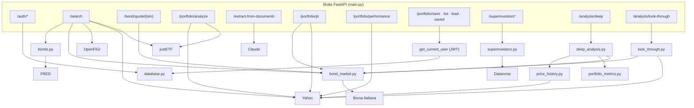
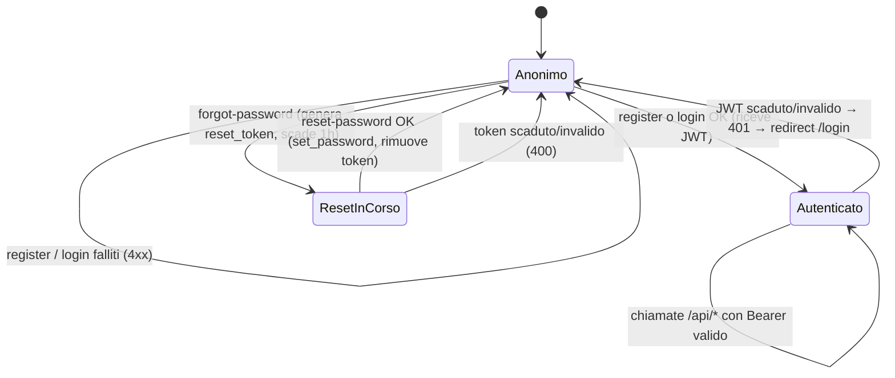
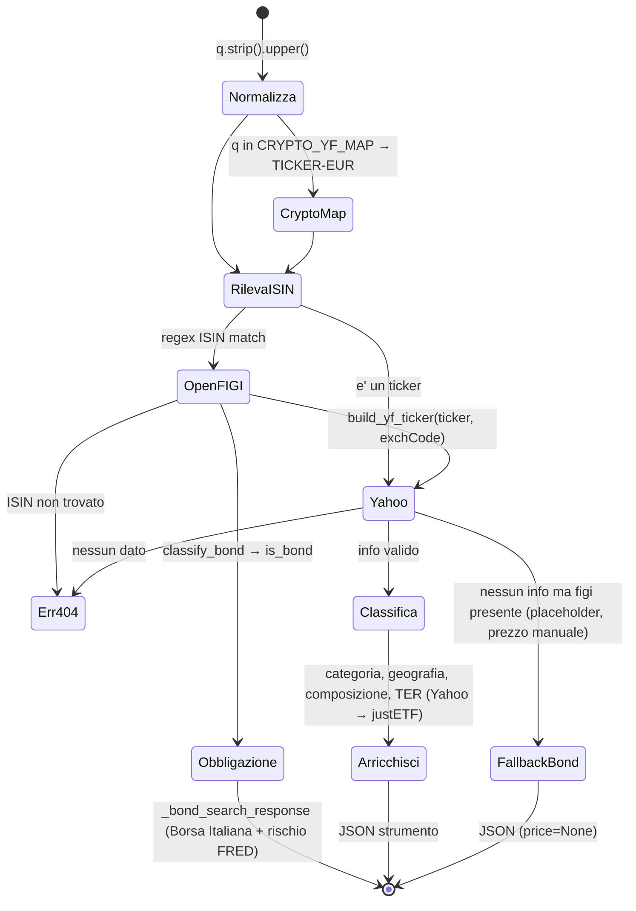
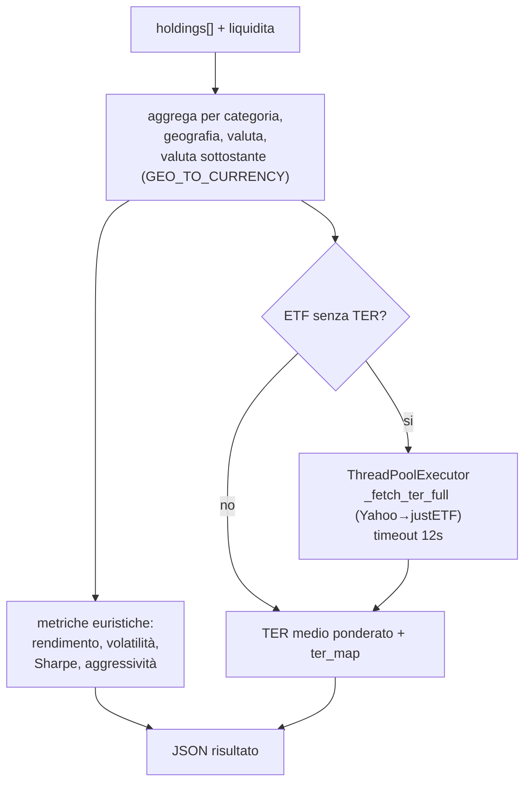

# Backend / API

[← Indice](README.md) · Correlati: [Architettura](architettura.md) · [Analisi](analisi.md) · [Database](database.md) · [Frontend](frontend.md) · [Infrastruttura](infrastruttura.md) · [Test](testing.md)

## Riassunto

Il backend FastAPI espone l'API REST sotto `/api/*`. `backend/main.py` contiene le rotte,
l'autenticazione JWT, la ricerca strumenti (ISIN→ticker via OpenFIGI, dati via Yahoo Finance),
l'analisi base del portafoglio, l'estrazione da PDF con Claude, P&L e performance. Le funzionalita'
piu' recenti vivono in moduli dedicati:

| Modulo | Responsabilita' |
| --- | --- |
| `main.py` | App FastAPI, rotte, auth, ricerca, analisi base, P&L, performance, estrazione PDF, save/load |
| `database.py` | Accesso DynamoDB (utenti, portafogli) — vedi [Database](database.md) |
| `bonds.py` | Riconoscimento obbligazioni da OpenFIGI, valuta/geografia dall'emittente, rischio sovrano da FRED |
| `bond_market.py` | Scraping quotazioni obbligazionarie da Borsa Italiana (MOT, EuroTLX) |
| `superinvestors.py` | Scraping portafogli 13F dei superinvestitori da Dataroma |
| `analysis_models.py` | Contratti pydantic dell'analisi approfondita |
| `price_history.py` | Storico prezzi in EUR da Yahoo |
| `portfolio_metrics.py` | Matematica pura degli indici di rischio/rendimento |
| `deep_analysis.py` | Analisi approfondita (`/api/analysis/deep`) |
| `look_through.py` | Radiografia di ETF e fondi (`/api/analysis/look-through`) |
| `exceptions.py` | Eccezioni custom (`InsufficientDataError`) |

La metodologia dell'analisi approfondita e' descritta in [Analisi](analisi.md).

Tutti gli endpoint `/api/*`, tranne quelli di autenticazione pubblici, richiedono un Bearer JWT
risolto da `get_current_user`.

## Grafico architetturale

## Grafo degli stati / interazioni

### Sessione utente (auth)

### Risoluzione di uno strumento (`/api/search`)

### Analisi base del portafoglio (`/api/portfolio/analyze`)

Le metriche di questa analisi sono **stime euristiche per asset class** (es. azioni 7–11%);
le metriche calcolate sui prezzi storici reali sono in `/api/analysis/deep` ([Analisi](analisi.md)).

## Modelli pydantic (contratti)

### main.py

| Modello | Campi principali | Usato da |
| --- | --- | --- |
| `RegisterRequest` | username, email, password | `/auth/register` |
| `LoginRequest` | username, password | `/auth/login` |
| `ForgotRequest` | email | `/auth/forgot-password` |
| `ResetRequest` | token, new_password | `/auth/reset-password` |
| `Holding` | isin, name, ticker, yf_ticker?, category, allocation, geography?, currency?, ter?, amount?, quantity?, purchase_price?, purchase_date? | `/portfolio/analyze` |
| `PortfolioRequest` | holdings: list[Holding], liquidita | `/portfolio/analyze` |
| `ExtractedInstrument` | isin, ticker, name, quantity?, purchase_price?, value?, purchase_date?, coupon?, maturity? | risposta `/extract-from-documents` |
| `ExtractionResponse` | items: list[ExtractedInstrument] | risposta `/extract-from-documents` |
| `PortfolioSave` | name, holdings: list, liquidita, inputMode, pac_entries: list, savedAt? | `/portfolio/save` |
| `PLRequest` | holdings: list (dict) | `/portfolio/pl` |
| `PerformanceHolding` / `PerformanceRequest` | yf_ticker, amount / holdings, liquidita | `/portfolio/performance` |
| `OverlapRequest` | symbols: list[str] | `/superinvestors/overlap` |

### Moduli dedicati

| Modello | Modulo | Contenuto |
| --- | --- | --- |
| `BondInfo` | `bonds.py` | is_bond, bond_type (Governativo/Corporate/Obbligazione), issuer_country, currency, geography |
| `SovereignRisk` | `bonds.py` | yield_10y, bund_spread_bps, risk_tier, as_of, note |
| `BondQuote` | `bond_market.py` | nome, mercato, prezzi (ultimo, riferimento, ufficiale), volumi, scadenza, cedole, lotto minimo |
| `Manager`, `ManagerPortfolio`, `ManagerHolding` | `superinvestors.py` | gestori e portafogli 13F |
| `ConsensusStock`, `StockOwnership`, `StockOwner` | `superinvestors.py` | titoli piu' posseduti, chi possiede un titolo |
| `DeepAnalysisRequest`, `AnalysisHolding` | `analysis_models.py` | input dell'analisi approfondita |
| `DeepAnalysisResponse`, `LookThroughResponse` (+ sotto-modelli) | `analysis_models.py` | output, dettagliati in [Analisi](analisi.md) |

## Endpoint — Input / Output

Legenda: 🔒 = richiede Bearer JWT (`get_current_user`).

### Autenticazione

| Endpoint | Metodo | Input | Output (200) | Errori |
| --- | --- | --- | --- | --- |
| `/api/auth/register` | POST | `RegisterRequest` | `{status, token, username}` | 400 password <6 o username/email in uso |
| `/api/auth/login` | POST | `LoginRequest` | `{token, username}` | 401 credenziali non valide |
| `/api/auth/forgot-password` | POST | `ForgotRequest` | `{status, message}` oppure `{status, reset_url, message}` se SMTP non configurato | sempre 200 (non rivela se l'email esiste) |
| `/api/auth/reset-password` | POST | `ResetRequest` | `{status, message}` | 400 token invalido/scaduto o password <6 |
| `/api/auth/me` | GET 🔒 | — | `{username, email, created_at}` | 401 / 404 utente non trovato |

### Strumenti

| Endpoint | Metodo | Input | Output (200) | Errori |
| --- | --- | --- | --- | --- |
| `/api/search` | GET 🔒 | query `q` (ISIN o ticker) | strumento: `{isin, ticker, yf_ticker, name, category, quoteType, price, currency, sector, industry, fundFamily, description, geography, composition, exch, isin_mismatch, ter}`; per le obbligazioni anche `price_unit:"pct_of_par", bond_type, issuer_country, sovereign_risk, market_data` | 404 ISIN/ticker non trovato |
| `/api/bond/quote/{isin}` | GET 🔒 | ISIN | `BondQuote` (Borsa Italiana) | 400 ISIN non valido; 404 non quotato |

### Portafoglio

| Endpoint | Metodo | Input | Output (200) | Errori |
| --- | --- | --- | --- | --- |
| `/api/portfolio/analyze` | POST 🔒 | `PortfolioRequest` | `{total, category_pct, geography, currency_exposure, underlying_currency_exposure, ter_map, metrics{expected_return, volatility, sharpe, aggressiveness, ter_medio}}` | 400 portafoglio vuoto |
| `/api/extract-from-documents` | POST 🔒 | multipart `files[]` (PDF o testo) | `ExtractionResponse {items[]}` | 400 no API key / no contenuto; 500 JSON AI invalido |
| `/api/portfolio/pl` | POST 🔒 | `PLRequest` (holdings con quantity, purchase_price, yf_ticker; obbligazioni con isin) | `{holdings[], total_value, total_cost, total_pl_eur, total_pl_pct}` | — (errori per-ticker assorbiti) |
| `/api/portfolio/performance` | POST 🔒 | `PerformanceRequest` | `{dates[], values[], return_pct, initial_value, current_value, covered_pct, failed_tickers[]}` | — |
| `/api/portfolio/save` | POST 🔒 | `PortfolioSave` | `{status:"saved", portfolio_id, savedAt}` | — |
| `/api/portfolio/list` | GET 🔒 | — | `[{portfolio_id, name, savedAt, holdings_count}]` | — |
| `/api/portfolio/load/{id}` | GET 🔒 | path `portfolio_id` | dati portafoglio salvato (+ portfolio_id, name) | 404 non trovato |
| `/api/portfolio/saved/{id}` | DELETE 🔒 | path `portfolio_id` | `{status:"deleted"}` | — |

In `/portfolio/pl` le obbligazioni (`category == "Obbligazioni"` con ISIN) sono valorizzate con il
prezzo Borsa Italiana in % del nominale: `valore = quantita' (nominale) × prezzo / 100`.

### Superinvestitori (Dataroma, dati 13F)

| Endpoint | Metodo | Input | Output (200) | Errori |
| --- | --- | --- | --- | --- |
| `/api/superinvestors` | GET 🔒 | — | `list[Manager]` | 502 Dataroma non raggiungibile |
| `/api/superinvestors/consensus` | GET 🔒 | query `limit` (1–100, default 50) | `list[ConsensusStock]` | 422 limit fuori range; 502 |
| `/api/superinvestors/overlap` | POST 🔒 | `OverlapRequest` (troncato a 40 simboli) | `list[StockOwnership]` ordinata per n° di gestori | — |
| `/api/superinvestors/{code}` | GET 🔒 | codice gestore (`^[A-Za-z0-9.]{1,12}$`) | `ManagerPortfolio` | 400 codice non valido; 404 gestore sconosciuto |

### Analisi approfondita

| Endpoint | Metodo | Input | Output (200) | Errori |
| --- | --- | --- | --- | --- |
| `/api/analysis/deep` | POST 🔒 | `DeepAnalysisRequest` | `DeepAnalysisResponse` (summary TWR/MWR, risk, equity_curve, holdings/classes P&L, allocation_over_time, correlation, frontier, distribution, monte_carlo, alternatives) | 400 vuoto; 422 parametri fuori range o storico insufficiente |
| `/api/analysis/look-through` | POST 🔒 | `DeepAnalysisRequest` | `LookThroughResponse` (asset class, settori, geografia, valute, esposizioni sottostanti, overlap ETF, obbligazioni, costi) | 400 vuoto |

Dettagli su calcoli e campi: [Analisi](analisi.md).

### Rotte statiche (solo in locale)

| Endpoint | Output |
| --- | --- |
| `/` | `frontend/index.html` |
| `/login` | `frontend/login.html` |
| `/analisi` | `frontend/analisi.html` |
| `/static/*` | file statici montati |

In produzione queste pagine sono servite da S3/CloudFront ([Infrastruttura](infrastruttura.md)).

## Funzioni interne chiave — Input / Output

### main.py

| Funzione | Input | Output | Note |
| --- | --- | --- | --- |
| `_load_aws_secrets()` | env `SECRETS_ARN` | — (popola env) | usa boto3 Secrets Manager; no-op in locale |
| `get_current_user(credentials)` | Bearer token | username (str) | decodifica JWT HS256; 401 se invalido/scaduto/senza `sub` |
| `_hash_pw / _verify_pw` | password | hash bcrypt / bool | tronca a 72 byte (limite bcrypt) |
| `_create_token(username)` | username | JWT (scade in 7 giorni) | claim `sub`, `exp` |
| `openfigi_items(isin)` | ISIN | righe OpenFIGI (o `[]`) | una sola chiamata, riusata da `isin_to_ticker` e `classify_bond` |
| `isin_to_ticker(isin, items)` | ISIN | `{ticker, name, exchCode, securityType, ...}` o `{}` | preferisce borse EUR (Xetra/Milano/Parigi) e tipi fondo/ETP per domicili ETF UE |
| `build_yf_ticker(ticker, exch)` | ticker, exchCode | ticker Yahoo (es. `IWVL.L`) | mappa exchCode→suffisso via `SUFFIX_MAP` |
| `guess_category_from_name(name, sec_type)` | nome, tipo | `"ETF"`/`"Criptovalute"`/`"Azioni"` | euristica keyword |
| `classify_etf_type(info, name)` | info Yahoo, nome | `"ETF Azionario"`/`"ETF Obbligazionario"` | usa `BOND_KEYWORDS` |
| `get_etf_geography(info)` | info Yahoo | dict regione→% | euristica su category/country |
| `get_etf_composition(info, ticker_obj)` | info, oggetto yfinance | top-10 holdings | da `funds_data.top_holdings` |
| `_bond_search_response(isin, figi, bond)` | ISIN, dati OpenFIGI, `BondInfo` | payload `/search` per obbligazioni | prezzo Borsa Italiana + rischio sovrano |
| `_ter_from_info(info)` | info Yahoo | TER % o None | normalizza decimale/percentuale, scarta valori fuori 0–5% |
| `_fetch_ter_yf(ticker)` | ticker | TER % o None | Yahoo info + fund_overview |
| `_fetch_ter_justetf(isin)` | ISIN | TER % o None | scraping HTML justETF (fallback) |
| `_fetch_ter_full(ticker, isin)` | ticker, isin | TER % o None | Yahoo poi justETF |

### bonds.py, bond_market.py, superinvestors.py

| Funzione | Input | Output | Note |
| --- | --- | --- | --- |
| `classify_bond(items, isin)` | righe OpenFIGI, ISIN | `BondInfo` | obbligazione se `marketSector` ∈ {Govt, Corp} o `securityType2` obbligazionario; valuta/regione dal prefisso ISIN |
| `fetch_sovereign_risk(iso2, currency)` | paese, valuta | `SovereignRisk` | FRED 10Y; area euro → livello da spread vs Bund, altrimenti da rendimento assoluto; `N/D` senza `FRED_API_KEY`; cache 6 h |
| `fetch_bond_quote(isin)` | ISIN | `BondQuote` o None | Borsa Italiana: prova MOT, poi EuroTLX; "non trovato" = redirect a `ricerca-avanzata`; cache 5 min (anche dei miss) |
| `list_managers()` | — | `list[Manager]` | Dataroma `/m/managers.php` |
| `fetch_manager_portfolio(code)` | codice | `ManagerPortfolio` o None | `/m/holdings.php?m=` |
| `fetch_consensus(limit)` | limite | `list[ConsensusStock]` | `/m/g/portfolio.php?o=c` |
| `fetch_stock_ownership(symbol)` | simbolo USA | `StockOwnership` o None | `/m/stock.php?sym=` |
| `fetch_portfolio_overlap(symbols)` | simboli | `list[StockOwnership]` | parallelo (6 worker), senza duplicati, ordinato per n° gestori |

Gli scraper di Dataroma hanno una cache di 6 ore e **non** mettono in cache i risultati vuoti
(un errore temporaneo non resta memorizzato).

### Analisi approfondita

Funzioni e formule sono documentate in [Analisi](analisi.md): `run_deep_analysis`,
`run_look_through`, `fetch_price_history`, `risk_metrics`, `xirr`, `correlation`,
`efficient_frontier`, `distribution`, `monte_carlo`, `bond_yield_duration`.

## Concorrenza e timeout

| Punto | Meccanismo |
| --- | --- |
| `/portfolio/analyze` | TER mancanti in parallelo (max 4 worker, timeout 12 s) |
| `/portfolio/pl` | prezzi correnti in parallelo (max 8 worker, timeout 10 s) |
| `/portfolio/performance` | storico 1 anno sequenziale per ticker; falliti in `failed_tickers` |
| `/analysis/deep` | un solo `yf.download` batch; valute mancanti lette in parallelo (max 8 worker) |
| `/analysis/look-through` | profili strumento in parallelo (max 8 worker, timeout complessivo 15 s → fallback per categoria) |
| `fetch_portfolio_overlap` | 6 worker su Dataroma |

La Lambda ha timeout 30 s ([Infrastruttura](infrastruttura.md)): per questo `deep` e
`look-through` sono due chiamate separate.

## Note e drift

- **Layering**: le preferenze del progetto prevedono `domain/`→`services/`→`adapters/`→`api/`.
  Il codice nuovo e' separato per responsabilita' (modelli, matematica pura, I/O, orchestrazione)
  ma in file piatti sotto `backend/`; `main.py` resta monolitico (~1190 righe) per auth, ricerca,
  analisi base, P&L ed estrazione.
- **Contratti non tipizzati** in `main.py`: `PortfolioSave.holdings`, `PortfolioSave.pac_entries`
  e `PLRequest.holdings` sono `list` generiche; `Holding.geography` e' `dict`.
- **Tipi**: i moduli nuovi (`analysis_models`, `price_history`, `portfolio_metrics`,
  `deep_analysis`, `look_through`, `exceptions`) passano `mypy --strict` e `ruff`; `main.py` no.
- **CORS aperto**: `allow_origins=["*"]` sia in FastAPI sia in API Gateway.
- **`import pandas` lazy** dentro `/portfolio/performance` (riduce il cold start quando l'endpoint non e' usato).
- **`pypdf` e' dichiarato** nelle dipendenze ma l'estrazione PDF e' delegata a Claude (PDF inviato
  come blocco `document` base64); `pypdf` non e' importato.
- **Cedola MOT**: la pagina MOT di Borsa Italiana non riporta cedola annua ne' frequenza, quindi
  per i BTP il rendimento a scadenza nel look-through non e' disponibile ([Analisi](analisi.md)).

## Riferimenti

- [Analisi](analisi.md) — metodologia dell'analisi approfondita.
- [Database](database.md) — funzioni invocate da auth e save/load.
- [Frontend](frontend.md) — chi consuma questi endpoint.
- [Architettura](architettura.md) — bootstrap, cold start, Mangum handler.
- [Test](testing.md) — copertura degli endpoint e degli scraper.
- [Riferimenti](riferimenti.md) — servizi esterni e variabili d'ambiente.
