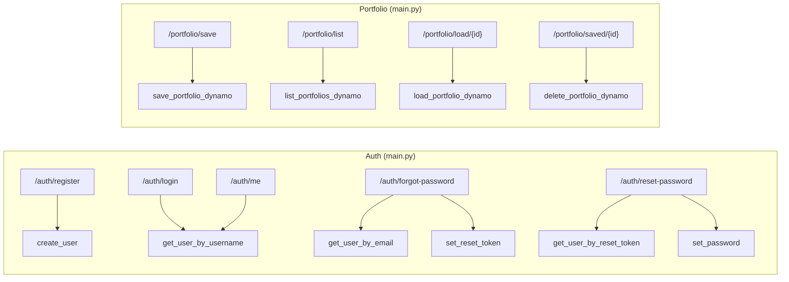

# Database

[← Indice](README.md) · Correlati: [Backend](backend.md) · [Infrastruttura](infrastruttura.md) · [Architettura](architettura.md)

## Riassunto

`backend/database.py` e' l'unico modulo di accesso ai dati: incapsula tutte le operazioni su
**DynamoDB** tramite boto3. Gestisce due tabelle — utenti e portafogli — e fornisce funzioni
idempotenti per crearle (`init_db`, chiamata all'avvio in [main.py](backend.md)). Le tabelle reali
in produzione sono create da Terraform ([infrastruttura.md](infrastruttura.md)); `init_db` le crea
on-demand quando non esistono (utile in locale / DynamoDB locale).

Region e nomi tabella sono letti da env (`AWS_REGION`, `DYNAMODB_TABLE`, `DYNAMODB_PORTFOLIOS_TABLE`)
con default `eu-central-1`, `portfoliolab_users`, `portfoliolab_portfolios`.

## Schema delle tabelle

```mermaid
erDiagram
  USERS {
    string username PK
    string email
    string hashed_password
    string created_at
    string reset_token "opzionale"
    string reset_token_expires "opzionale"
  }
  PORTFOLIOS {
    string username PK
    string portfolio_id SK
    string name
    string data "JSON serializzato del portafoglio"
    string savedAt
    string holdings_count
  }
  USERS ||--o{ PORTFOLIOS : "username"
```

- **users**: hash key `username`. Billing PAY_PER_REQUEST.
- **portfolios**: hash key `username` + range key `portfolio_id` (UUID). Billing PAY_PER_REQUEST.
  Un utente puo' avere N portafogli; `query` per `username` li restituisce tutti.

## Funzioni — Input / Output

| Funzione | Input | Output | Operazione DynamoDB |
| --- | --- | --- | --- |
| `init_db()` | — | — | `describe_table` + `create_table` se assente (entrambe le tabelle) |
| `get_user_by_username(username)` | username | item utente o None | `get_item` (chiave) |
| `get_user_by_email(email)` | email | item o None | `scan` con filtro |
| `get_user_by_reset_token(token)` | token | item o None | `scan` con filtro |
| `create_user(username, email, hashed_password)` | dati utente | — (raise `ValueError`) | `put_item` con `ConditionExpression attribute_not_exists(username)`; controlla email duplicata prima |
| `set_reset_token(username, token, expires)` | username, token, ISO expires | — | `update_item` SET |
| `set_password(username, hashed_password)` | username, hash | — | `update_item` SET + REMOVE reset_token |
| `save_portfolio_dynamo(username, name, data)` | dati | `portfolio_id` (UUID) | `put_item`; serializza `data` in JSON |
| `list_portfolios_dynamo(username)` | username | lista ordinata per `savedAt` desc | `query` per username |
| `load_portfolio_dynamo(username, portfolio_id)` | chiave | dict portafoglio o None | `get_item`; deserializza JSON |
| `delete_portfolio_dynamo(username, portfolio_id)` | chiave | — | `delete_item` |

## Interazioni con il backend



## Note e drift

- **`get_user_by_email` / `get_user_by_reset_token` usano `scan`** (table-scan completo con filtro).
  Funziona ma non scala: non esiste GSI su `email`/`reset_token`. Da rivedere se la tabella cresce.
- **`holdings_count` salvato come stringa** (`str(len(...))`) e ri-castato a `int` in lettura — DynamoDB
  accetta numeri nativi, qui e' una scelta esplicita.
- **Permessi IAM**: la Lambda ha `GetItem/PutItem/UpdateItem/DeleteItem/Query/Scan/DescribeTable`
  su entrambe le tabelle (vedi [infrastruttura.md](infrastruttura.md#iam-della-lambda)).

## Test

Nei test `database.py` non viene mai chiamato: `init_db` e' disattivato prima dell'import di
`main.py` e le funzioni importate in `main` sono sostituite da `FakeDB` (in memoria, stessa
interfaccia) tramite la fixture `fake_db`. Vedi [Test](testing.md).

## Riferimenti

- [Backend](backend.md) — chi chiama queste funzioni.
- [Infrastruttura](infrastruttura.md) — definizione Terraform delle tabelle e policy IAM.
- [Architettura](architettura.md) — `init_db()` nel bootstrap.
