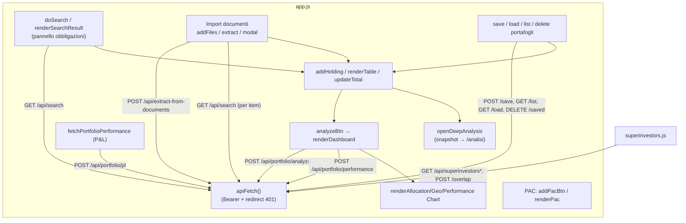
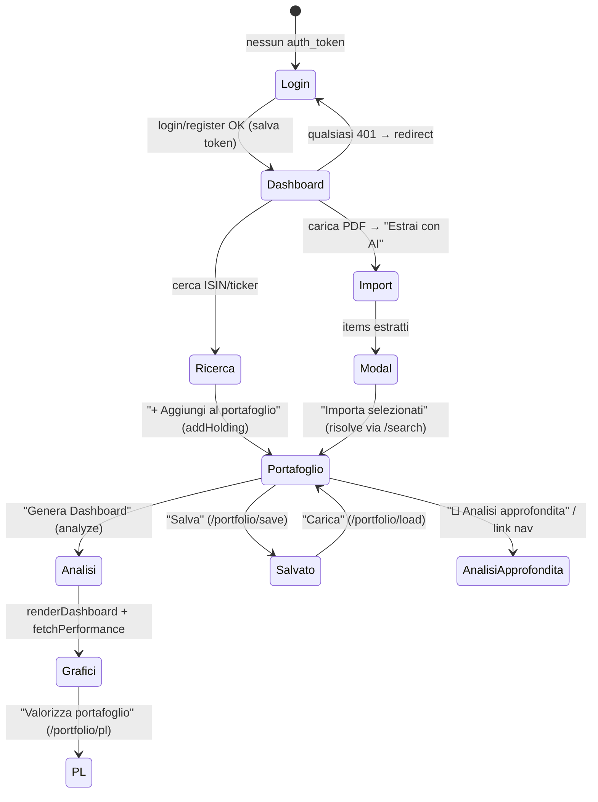
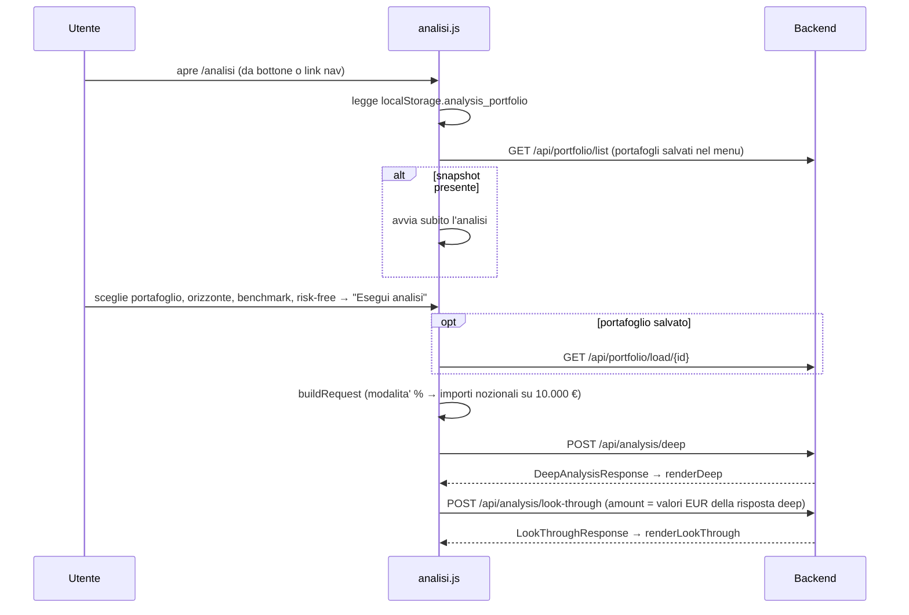

# Frontend

[← Indice](README.md) · Correlati: [Backend](backend.md) · [Analisi](analisi.md) · [Architettura](architettura.md)

## Riassunto

Il frontend e' composto da pagine HTML statiche in **JavaScript vanilla**, senza framework ne'
build step. Grafici con **Chart.js 4.4** (CDN jsdelivr).

| File | Ruolo |
| --- | --- |
| `frontend/index.html` | Dashboard principale: ricerca, portafoglio, analisi base, P&L, PAC, superinvestitori |
| `frontend/login.html` | Login / registrazione / recupero password (script inline) |
| `frontend/analisi.html` | Pagina **Analisi approfondita** (`/analisi`) |
| `static/js/app.js` (~1500 righe) | Logica della dashboard |
| `static/js/superinvestors.js` | Sezione "Superinvestitori" della dashboard (usa `API`, `apiFetch`, `portfolio` di `app.js`) |
| `static/js/session.js` | Sessione condivisa da tutte le pagine (`window.Session`): `apiFetch` con Bearer + salvataggio del token rinnovato (`X-Refreshed-Token`), `guard()` che fa logout dopo 30 min di inattività e rinnova il token sull'attività utente, `valid()` usato da `login.html` |
| `static/js/analisi.js` | Pagina analisi: sorgenti dati, chiamate API, KPI, tabelle, heatmap, barre HTML |
| `static/js/analisi-charts.js` | Pagina analisi: renderer Chart.js (espone `window.AnCharts`) |
| `static/css/style.css` | Stile comune (tema scuro) |
| `static/css/analisi.css` | Stile e token colore della pagina analisi |

Lo stato vive nel browser (variabili di modulo + `localStorage`). Il backend e' invocato via
`fetch` con `Authorization: Bearer <token>`; su `401` il client cancella il token e reindirizza a `/login`.

## Stato client

| Chiave / variabile | Dove | Significato |
| --- | --- | --- |
| `portfolio[]` | `app.js` | holdings correnti `{isin, ticker, yf_ticker, name, category, allocation, amount, geography, currency, ter, quantity, purchase_price, purchase_date}` |
| `pac[]` | `app.js` | piani di accumulo (solo client; salvati con il portafoglio) |
| `inputMode` | `app.js` | `'pct'` (allocazioni %) o `'amount'` (importi EUR) |
| `lastSearchData` | `app.js` | ultimo risultato di `/api/search` |
| `allocationChart`, `geoChart`, `perfChart` | `app.js` | istanze Chart.js |
| `localStorage.auth_token`, `auth_username` | `session.js` | sessione JWT (30 min scorrevoli) |
| `localStorage.analysis_portfolio` | `app.js` → `analisi.js` | snapshot del portafoglio corrente passato alla pagina analisi `{name, holdings, liquidita, inputMode, savedAt}` |

## Dashboard (`index.html` + `app.js`)

`login.html` (script separato) chiama direttamente `fetch('/api/auth/login' | '/register' | '/forgot-password' | '/reset-password')`.

### Grafo degli stati (interazione principale)

### Flussi — Input / Output

| Azione utente | Funzione | Chiamata API | Effetto |
| --- | --- | --- | --- |
| Cerca strumento | `doSearch` | `GET /api/search?q=` | `renderSearchResult` (per le obbligazioni `renderBondPanel` con dati Borsa Italiana e rischio sovrano) |
| Aggiungi al portafoglio | `addHolding` | — | push in `portfolio[]`, `renderTable` |
| Toggle %/importi | `modeToggle` | — | converte tra `pct` e `amount`, ricalcola totali |
| Genera dashboard | `analyzeBtn` | `POST /api/portfolio/analyze` | grafici e metriche; arricchisce il TER da `ter_map`; poi `fetchPerformance` |
| Performance storica | `fetchPerformance` | `POST /api/portfolio/performance` | grafico a linee, periodi 1m/3m/6m/1y |
| Importa da documenti | `extractBtn` → modal → `importSelectedBtn` | `POST /api/extract-from-documents`, poi `GET /api/search` per item | popola `portfolio[]` |
| Salva / carica / elimina | `savePortfolio`, `openPortfolioList`, `loadPortfolio`, `deletePortfolio` | `/api/portfolio/save · list · load · saved` | `applyLoadedPortfolio` |
| P&L | `fetchPortfolioPerformance` | `POST /api/portfolio/pl` | tabella P&L per holding con quantita' |
| Superinvestitori | `superinvestors.js` (tab "Più posseduti", "Portafogli", "I tuoi titoli") | `GET /api/superinvestors/consensus`, `GET /api/superinvestors`, `GET /api/superinvestors/{code}`, `POST /api/superinvestors/overlap` | tabelle; il tab "I tuoi titoli" invia i ticker del portafoglio corrente |
| Analisi approfondita | `openDeepAnalysis` | — | salva lo snapshot in `localStorage.analysis_portfolio` e apre `/analisi` |

## Pagina Analisi approfondita (`/analisi`)

Metodologia e formule: [Analisi](analisi.md).

### Sezioni della pagina

| Sezione | Contenuto | Rendering |
| --- | --- | --- |
| Rendimento dall'acquisto | KPI (valore, investito, P&L, TWR, MWR, max drawdown, Sharpe, beta); valore vs investito; TWR vs benchmark; drawdown | `kpi()`, `AnCharts.value/twr/drawdown` |
| Guadagno per asset class | barre P&L € + tabella | `AnCharts.classPL`, `renderClassTable` |
| Contributo al rendimento | waterfall capitale investito → effetto prezzo per asset class + effetto cambio → valore attuale; tabella di riconciliazione per strumento | `AnCharts.waterfall`, `renderHoldingTable` |
| Allocazione e drift | aree impilate % per asset class; barre di drift con soglia ±5 p.p. | `AnCharts.allocTime/drift` |
| Look-through | barre asset class, geografia, settori; esposizioni sottostanti con tag "overlap"; overlap tra ETF | `hbars()`, tabelle |
| Obbligazioni | duration media, qualita' del credito (barra impilata), tabella titoli | `renderBonds` |
| Costi e valuta | TER ponderato, costo annuo/10 anni, quota hedged, valute | `renderCosts` |
| Rischio | tabella portafoglio vs benchmark; heatmap correlazioni (HTML); correlazione media rolling | `renderRisk`, `renderCorrelation`, `AnCharts.rollingCorr` |
| Frontiera efficiente | nuvola di portafogli simulati, frontiera, portafoglio attuale / min vol / max Sharpe + pesi | `AnCharts.frontier`, `renderFrontier` |
| Distribuzione e Monte Carlo | istogramma vs normale + skew/curtosi/VaR; ventaglio 5–95% e 25–75% a 10 anni | `AnCharts.distribution/monteCarlo` |
| Allocazioni alternative | crescita di 10.000 € vs 100% azionario, 80/20, 60/40 + tabella | `AnCharts.alternatives` |

Note ("data stimata", strumenti senza storico e copertura, importi nozionali) sono mostrate sotto
i controlli.

### Convenzioni grafiche

- Palette categoriale **validata** (daltonismo, contrasto) contro la superficie delle card
  `#161929`, definita come token `--series-1…8` in `analisi.css`.
- Colore **fisso per asset class** (`CAT_SLOT` in `analisi-charts.js`): il colore segue l'entita', non la posizione.
- Verde/rosso (`--good`/`--critical`) solo per guadagno/perdita; blu/arancio per il drift (non e' ne' buono ne' cattivo).
- Un solo asse y per grafico; tooltip su tutti i grafici; ogni grafico principale ha una tabella con i valori.
- Tutti i testi provenienti da API o utente passano da `esc()` prima di finire in `innerHTML`.
- Layout responsive: griglie a colonna singola sotto 960 px; tabelle con scroll orizzontale interno.

## Dettagli rilevanti

- **`apiFetch`** centralizza l'header `Authorization` e il redirect su 401 (in `analisi.js` ne esiste
  una copia locale, perche' `app.js` e' legato al DOM della dashboard).
- **Mappe colore/icone** di `app.js` (`CAT_COLORS`, `GEO_COLORS`, `CUR_COLORS`, `CUR_FLAGS`) e
  `CAT_SLOT` di `analisi-charts.js` devono restare allineate alle categorie prodotte dal backend.
- **PAC** e' interamente client-side: calcola la prossima rata (`pacNextDate`) e viene salvato in
  `PortfolioSave.pac_entries`. Non entra nell'analisi approfondita.
- `amount` di un holding e' in EUR; in modalita' `amount` le percentuali sono ricalcolate da `updateTotal`.
- Chart.js in `analisi.html` e' caricato con Subresource Integrity (`integrity="sha384-…"`).

## Riferimenti

- [Backend](backend.md) — contratti degli endpoint consumati.
- [Analisi](analisi.md) — significato di ogni indice e grafico.
- [Architettura](architettura.md) — servizio del frontend (locale vs S3/CloudFront).
- [Infrastruttura](infrastruttura.md) — CloudFront Function url-rewrite per `/login` e `/analisi`.
