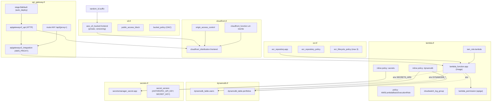
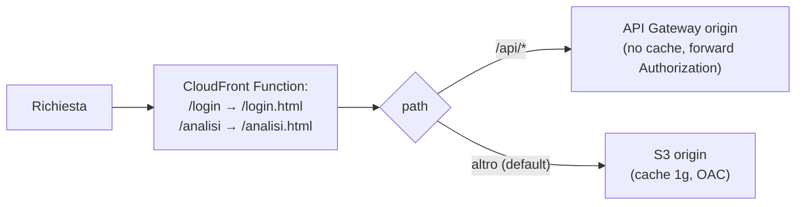
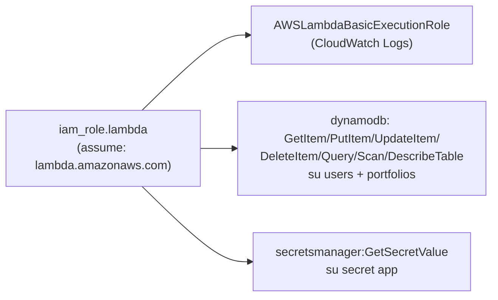
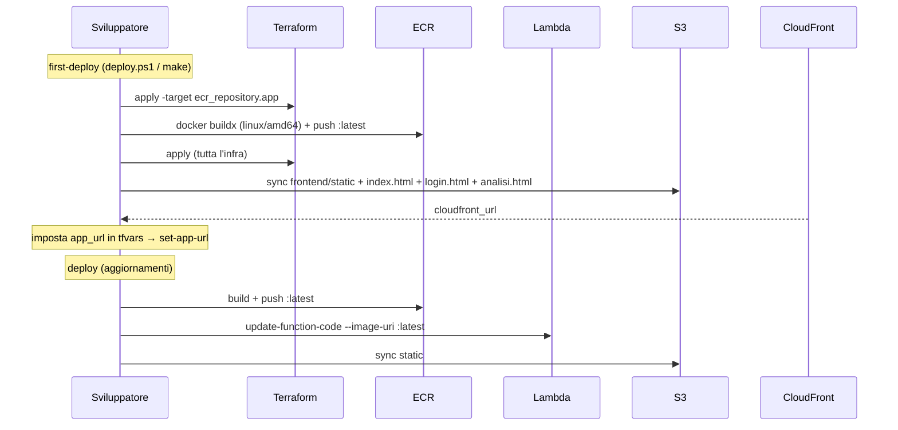

# Infrastruttura (Terraform)

[← Indice](README.md) · Correlati: [Architettura](architettura.md) · [Backend](backend.md) · [Database](database.md)

## Riassunto

L'infrastruttura AWS e' definita in `terraform/` (provider `aws ~> 5.0`, region default
`eu-central-1`). Il pattern e' **serverless full**: CloudFront fa da unico ingresso pubblico e
instrada i file statici a S3 (privato, via Origin Access Control) e le rotte `/api/*` ad API
Gateway → Lambda (immagine container da ECR). I dati stanno su due tabelle DynamoDB e i segreti
in Secrets Manager. Tutte le risorse usano `var.app_name` (default `portfoliolab`) come prefisso.

Deploy via `Makefile` (Linux/macOS) o `deploy.ps1` (Windows PowerShell).

## Mappa delle risorse

## Routing CloudFront

- **default behavior** → S3, metodi GET/HEAD, cache fino a 1 giorno, compressione.
- **`/api/*` behavior** → API Gateway, tutti i metodi, `default_ttl=0` (no cache), forward di
  `Authorization`, `Content-Type`, `Origin` e query string.
- `price_class = PriceClass_100` (solo EU + Nord America), certificato CloudFront default.

## Risorse per file

| File | Risorse principali |
| --- | --- |
| `main.tf` | provider aws + random; `random_id.suffix` (suffisso bucket) |
| `variables.tf` | `aws_region`, `app_name`, `environment`, `anthropic_api_key` (sensitive), `jwt_secret_key` (sensitive), `fred_api_key` (sensitive, default vuoto), `anthropic_model`, `app_url`, `lambda_memory_mb` (1024), `lambda_timeout_seconds` (30) |
| `outputs.tf` | `cloudfront_url`, `cloudfront_domain`, `api_gateway_endpoint`, `ecr_repository_url`, `s3_bucket_name`, `lambda_function_name` |
| `s3.tf` | bucket privato `frontend`, public access block, versioning, bucket policy per OAC |
| `cloudfront.tf` | OAC, CloudFront Function url-rewrite (`/login`, `/analisi` → `.html`), distribuzione con 2 origin (S3 + API GW) |
| `api_gateway.tf` | HTTP API v2, integrazione AWS_PROXY, route `ANY /api/{proxy+}`, stage `$default` |
| `lambda.tf` | IAM role + policy (logs, dynamodb, secrets), log group, funzione Lambda (Image), permission per API GW |
| `ecr.tf` | repository, repository policy (accesso Lambda), lifecycle policy (tiene 3 immagini) |
| `dynamodb.tf` | tabelle `users` (hash username) e `portfolios` (hash username, range portfolio_id) |
| `secrets.tf` | secret `app` + version con `ANTHROPIC_API_KEY`, `SECRET_KEY` (JWT) e `FRED_API_KEY` |

## Variabili d'ambiente della Lambda

Impostate in `lambda.tf` (`environment.variables`):

| Variabile | Valore | Usata in |
| --- | --- | --- |
| `SECRETS_ARN` | ARN del secret | `_load_aws_secrets` ([backend](backend.md)) |
| `ANTHROPIC_MODEL` | `var.anthropic_model` | `/extract-from-documents` |
| `DYNAMODB_TABLE` | nome tabella users | [database.py](database.md) |
| `DYNAMODB_PORTFOLIOS_TABLE` | nome tabella portfolios | [database.py](database.md) |
| `APP_URL` | URL CloudFront (solo dopo il primo deploy) | link reset password |

> `ANTHROPIC_API_KEY`, `SECRET_KEY` e `FRED_API_KEY` **non** sono env var dirette: sono lette a
> runtime da Secrets Manager e iniettate in `os.environ` da `_load_aws_secrets()`. Con
> `fred_api_key` vuota il rischio sovrano delle obbligazioni risulta `N/D` (nessun errore).

## IAM della Lambda

## Workflow di deploy

> Aggiungendo una nuova pagina HTML servono tre passi: upload in `deploy.ps1`/`Makefile`,
> regola nella CloudFront Function (se si vuole l'URL senza `.html`) e rotta FastAPI per l'uso in locale.

> Nota: il tag immagine e' sempre `:latest`, quindi Terraform non rileva il cambio di codice — per
> questo `deploy` usa `aws lambda update-function-code` esplicito (vedi commento in `Makefile`).

## Note e drift / conformita'

- **Tag**: le risorse usano tag `App` e `Env`, **non** i tag `Environment`/`Project`/`ManagedBy=terraform`
  raccomandati nelle preferenze utente. Manca anche `versions.tf` separato (i provider sono in `main.tf`).
- **State locale**: nessun backend remoto S3+DynamoDB lock configurato (lo state Terraform e' locale).
- **Timeout Lambda 30 s**: l'analisi approfondita e' divisa in due chiamate (`/analysis/deep` e
  `/analysis/look-through`) per restare sotto il limite con portafogli grandi.
- **CORS aperto** su API Gateway (`allow_origins=["*"]`), coerente con FastAPI.
- **`init_db()` ridondante in produzione**: le tabelle esistono gia' via Terraform; `init_db`
  (DescribeTable) e' comunque eseguito ad ogni cold start — l'IAM include `DescribeTable` apposta.

## Riferimenti

- [Architettura](architettura.md) — diagramma end-to-end e cold start.
- [Backend](backend.md) — uso di `SECRETS_ARN`, env DynamoDB, Mangum handler.
- [Database](database.md) — schema tabelle definite qui.
- [Riferimenti](riferimenti.md) — variabili d'ambiente e servizi esterni.
