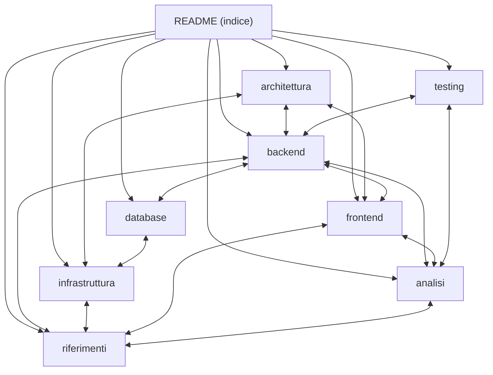

# Riferimenti / Glossario

[← Indice](README.md) · Correlati: [Backend](backend.md) · [Analisi](analisi.md) · [Frontend](frontend.md) · [Infrastruttura](infrastruttura.md) · [Test](testing.md)

## Servizi esterni

| Servizio | Uso | Dove (codice) | Accesso |
| --- | --- | --- | --- |
| [OpenFIGI](https://www.openfigi.com/api) | ISIN → ticker / borsa; riconoscimento obbligazioni | `openfigi_items`, `isin_to_ticker`, `classify_bond` | API pubblica senza chiave |
| [Yahoo Finance](https://finance.yahoo.com/) (via `yfinance`) | Prezzi, info, storico, top holdings, composizione ETF, TER | `/search`, `/portfolio/*`, `price_history.py`, `look_through.py` | libreria non ufficiale |
| [justETF](https://www.justetf.com/) | TER per ETF UCITS assenti su Yahoo | `_fetch_ter_justetf` | scraping HTML |
| [Borsa Italiana](https://www.borsaitaliana.it/) | Quotazioni obbligazioni MOT / EuroTLX (prezzo, scadenza, cedola) | `bond_market.fetch_bond_quote` | scraping pagine "dati completi" |
| [Dataroma](https://www.dataroma.com/) | Portafogli 13F dei superinvestitori | `superinvestors.py` | scraping HTML (`table#grid`) |
| [FRED](https://fred.stlouisfed.org/docs/api/fred/) | Rendimenti dei titoli di Stato a 10 anni (serie OECD `IRLTLT01<cc>M156N`) | `bonds.fetch_sovereign_risk` | API key gratuita (`FRED_API_KEY`) |
| [Anthropic Claude](https://docs.anthropic.com/) | Estrazione strumenti da PDF/testo | `/extract-from-documents` | `ANTHROPIC_API_KEY` |

Gli scraper dipendono dal layout HTML dei siti: i test `live` ([Test](testing.md)) servono ad
accorgersi dei cambiamenti.

## Variabili d'ambiente

| Variabile | Default | Scopo |
| --- | --- | --- |
| `SECRET_KEY` | `change-me-in-production...` | Firma JWT (HS256) |
| `SECRETS_ARN` | — | Se presente, attiva il fetch da Secrets Manager |
| `AWS_REGION` / `AWS_DEFAULT_REGION` | `eu-central-1` | Region boto3 |
| `DYNAMODB_TABLE` | `portfoliolab_users` | Tabella utenti |
| `DYNAMODB_PORTFOLIOS_TABLE` | `portfoliolab_portfolios` | Tabella portafogli |
| `ANTHROPIC_API_KEY` | — | API key Claude (da Secrets Manager o `.env`) |
| `ANTHROPIC_MODEL` | `claude-sonnet-4-6` | Modello usato per l'estrazione |
| `FRED_API_KEY` | — | Rischio sovrano delle obbligazioni; senza chiave il livello e' `N/D` |
| `APP_URL` | `http://localhost:8000` | Base URL per link reset password |
| `SMTP_HOST` / `SMTP_PORT` / `SMTP_USER` / `SMTP_PASS` | — / `587` | Invio email reset (opzionale; se assente, link restituito in risposta) |

## Tooling del progetto

- **Package manager**: `uv` (`pyproject.toml`, `uv.lock`). Eseguire sempre con `uv run ...`.
- **Runtime backend**: Python 3.11+ in locale; immagine Lambda Python 3.12 (`Dockerfile`).
- **Test**: `pytest` (dev dependency), vedi [Test](testing.md). `uv run pytest` / `uv run pytest -m live`.
- **Qualita'**: `ruff` (format + check) e `mypy --strict` sui moduli nuovi, eseguibili senza
  installarli nel progetto: `uvx ruff check backend tests`, `uvx --with pydantic mypy --strict --ignore-missing-imports backend/<modulo>.py`.
- **Deploy**: `Makefile` (target `first-deploy`, `deploy`, `tf-*`, `image-push`, `upload-static`,
  `set-app-url`) e `deploy.ps1` (equivalente PowerShell per Windows).
- **Dipendenze chiave**: fastapi, uvicorn, mangum, yfinance (porta con se' pandas e numpy),
  requests, pydantic, anthropic, python-jose (JWT), bcrypt, boto3, python-multipart,
  python-dotenv, pypdf. Dev: httpx (TestClient), pytest.

## Glossario

### Dati e strumenti

| Termine | Significato |
| --- | --- |
| ISIN | International Securities Identification Number (12 caratteri) |
| yf_ticker | Ticker nel formato Yahoo Finance (con suffisso borsa, es. `IWVL.L`) |
| TER | Total Expense Ratio — costo annuo % di un ETF/fondo |
| KID | Key Information Document: fonte ufficiale dei costi di un prodotto |
| PAC | Piano di Accumulo del Capitale (investimenti ricorrenti) |
| P&L | Profit & Loss — guadagno/perdita rispetto al prezzo di carico |
| Prezzo di carico | Prezzo medio di acquisto (`purchase_price`), nella valuta dello strumento |
| Hedged | ETF con copertura del rischio cambio verso l'euro |
| GBp / GBX | Quotazione in pence (1/100 di sterlina) usata dalla Borsa di Londra |
| 13F | Modulo trimestrale SEC con le posizioni azionarie USA dei grandi gestori |
| MOT / EuroTLX | Mercati obbligazionari di Borsa Italiana |
| Corso secco / tel quel | Prezzo di un'obbligazione senza / con il rateo di interessi maturato |
| Rateo | Quota della cedola maturata dall'ultimo stacco |
| `_altri` | Chiave segnaposto in `GEO_TO_CURRENCY` per valute residuali (non emessa nell'output) |

### Indici e analisi

| Termine | Significato |
| --- | --- |
| TWR | Time-weighted return: rendimento degli strumenti, neutralizzando tempi e importi dei versamenti |
| MWR / XIRR | Money-weighted return: tasso annuo che eguaglia i flussi al valore finale; il rendimento dell'investitore, timing compreso |
| CAGR | Tasso di crescita annuo composto |
| Volatilita' | Deviazione standard annualizzata dei rendimenti giornalieri |
| Drawdown / max drawdown | Calo dal massimo precedente / il calo peggiore |
| Sharpe | Rendimento in eccesso sul risk-free per unita' di volatilita' |
| Sortino | Come Sharpe ma con la sola volatilita' al ribasso |
| Calmar | CAGR diviso il max drawdown |
| Beta | Sensibilita' del portafoglio al benchmark (1 = si muove come il benchmark) |
| VaR / CVaR 95% | Perdita giornaliera superata nel 5% dei giorni / perdita media in quei giorni |
| Skew / curtosi | Asimmetria / spessore delle code della distribuzione dei rendimenti |
| Correlazione rolling | Correlazione calcolata su una finestra mobile (qui 63 giorni) |
| Frontiera efficiente | Portafogli con il rendimento atteso piu' alto per ogni livello di volatilita' |
| Monte Carlo | Simulazione di molti scenari futuri casuali per stimare la distribuzione dei risultati |
| Look-through / X-Ray | Analisi di cosa contengono davvero ETF e fondi |
| Overlap | Titoli presenti in piu' strumenti del portafoglio |
| Drift | Scostamento dell'allocazione attuale da quella target (in punti percentuali) |
| Duration (modificata) | Variazione % approssimativa del prezzo di un'obbligazione per +1% di tassi |
| YTM | Rendimento a scadenza di un'obbligazione |
| Effetto cambio | Parte del P&L dovuta al movimento della valuta, non dello strumento |
| Waterfall / ponte | Grafico che scompone il passaggio da un valore iniziale a uno finale nei suoi contributi |

### Infrastruttura

| Termine | Significato |
| --- | --- |
| OAC | Origin Access Control — accesso CloudFront → S3 privato |
| Mangum | Adapter ASGI che fa girare FastAPI dentro AWS Lambda |

## Mappa della documentazione

## Riferimenti

- [Indice](README.md)
- [Architettura](architettura.md) · [Backend](backend.md) · [Analisi](analisi.md) · [Database](database.md) · [Frontend](frontend.md) · [Infrastruttura](infrastruttura.md) · [Test](testing.md)
