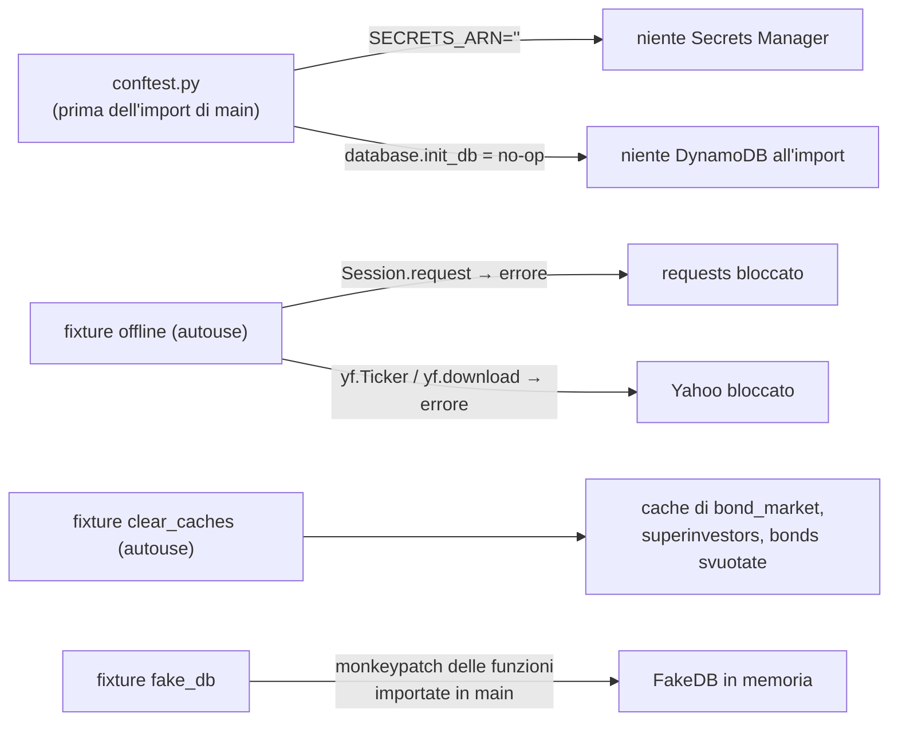

# Test

[← Indice](README.md) · Correlati: [Backend](backend.md) · [Analisi](analisi.md) · [Riferimenti](riferimenti.md)

## Riassunto

La suite usa **pytest** (dev dependency) e gira **completamente offline**: rete e Yahoo Finance
sono bloccati, gli scraper leggono pagine HTML reali salvate in `tests/fixtures/`, DynamoDB e
Anthropic sono sostituiti da fake in memoria. Una seconda serie di test, marcata `live`, interroga
i siti veri per accorgersi quando cambiano layout.

```bash
uv run pytest            # test offline (default, ~4 s)
uv run pytest -m live    # test sui siti reali (Borsa Italiana, Dataroma, justETF, OpenFIGI, Yahoo)
uv run pytest tests/backend/test_portfolio_metrics.py -q   # un solo modulo
```

La configurazione e' in `pyproject.toml` (`[tool.pytest.ini_options]`): `testpaths`,
`pythonpath = [".", "tests"]`, `-m 'not live'` di default, registrazione del marker `live`,
filtro di un warning noto di `mangum`.

## Struttura

`tests/` rispecchia `backend/`:

| File | Cosa verifica |
| --- | --- |
| `tests/conftest.py` | Fixture condivise: blocco rete, reset delle cache, `fake_db`, `client`, `auth_headers` |
| `tests/fakes.py` | Test double: `FakeResponse`, `FakeTicker`/`FakeFundsData`, `FakeDB`, costruttori di storici prezzi |
| `tests/test_offline_guard.py` | Che HTTP e Yahoo siano davvero bloccati nei test offline |
| `tests/backend/test_portfolio_metrics.py` | Indici: CAGR, volatilita', Sharpe, Sortino, Calmar, beta, VaR/CVaR, skew/curtosi, drawdown, XIRR, correlazioni, frontiera, distribuzione, Monte Carlo |
| `tests/backend/test_deep_analysis.py` | TWR vs MWR, effetto prezzo/cambio, asset class e drift, allocazione nel tempo, vista orizzonte, obbligazioni senza storico, modalita' nozionale, errori |
| `tests/backend/test_look_through.py` | Rendimento/duration obbligazionari, profili ETF/azioni, fallback, esposizioni e overlap, costi, valute/hedging, rating |
| `tests/backend/test_price_history.py` | Conversione in EUR, unita' minori (GBp), weekend, cambi mancanti |
| `tests/backend/test_bond_market.py` | Scraper Borsa Italiana su pagine MOT/EuroTLX reali, parser numeri/date italiani, routing, cache, errori |
| `tests/backend/test_superinvestors.py` | Scraper Dataroma su pagine reali (gestori, Berkshire, grand portfolio, AAPL), cache e fallimenti |
| `tests/backend/test_bonds.py` | Classificazione obbligazioni da OpenFIGI, livelli di rischio, FRED (spread vs Bund, cache, chiave assente) |
| `tests/backend/test_main_helpers.py` | OpenFIGI, scelta della borsa, suffissi Yahoo, categorie, geografia ETF, TER da Yahoo e scraping justETF |
| `tests/backend/api/test_api_auth.py` | Registrazione, login, `/me`, token invalidi/scaduti/falsificati, reset password |
| `tests/backend/api/test_api_instruments.py` | `/api/search` (crypto, ETF, obbligazioni, 404, ETC) e `/api/bond/quote` |
| `tests/backend/api/test_api_portfolio.py` | analyze, P&L, performance, save/list/load/delete (anche isolamento tra utenti), estrazione documenti |
| `tests/backend/api/test_api_superinvestors_analysis.py` | Endpoint superinvestitori, `/api/analysis/*`, pagine statiche |
| `tests/backend/test_live_scraping.py` | Marker `live`: verifiche sui siti reali |

I nomi seguono la convenzione `test_<cosa>_when_<condizione>_then_<atteso>`.

## Come funziona l'isolamento



- Un test che ha bisogno di dati esterni sostituisce **solo** la funzione che li scarica
  (`monkeypatch.setattr(modulo, "funzione", fake)`), mai l'intero modulo.
- I test `live` saltano il blocco della rete (`@pytest.mark.live`).
- `client` e' un `TestClient` FastAPI con il DB finto; `auth_headers` contiene un JWT valido per l'utente `mario`.

## Fixture HTML (scraping)

Pagine reali catturate il 27/09/2026 in `tests/fixtures/`:

| File | Origine |
| --- | --- |
| `borsa_mot_btp_IT0005436693.html` | Borsa Italiana, MOT, BTP 0,6% ago 2031 |
| `borsa_eurotlx_US912810TD00.html` | Borsa Italiana, EuroTLX, Treasury 2,25% feb 2052 (cp1252) |
| `dataroma_managers.html` | Dataroma, lista gestori (ridotta ai primi 5) |
| `dataroma_holdings_BRK.html` | Dataroma, portafoglio Berkshire Hathaway |
| `dataroma_grand_portfolio.html` | Dataroma, titoli piu' posseduti |
| `dataroma_stock_AAPL.html` | Dataroma, gestori che possiedono AAPL |
| `justetf_profile_IE00B4L5Y983.html` | Estratto della pagina justETF di iShares Core MSCI World |

**Quando un test `live` fallisce** il sito ha probabilmente cambiato layout: aggiorna lo scraper,
riscarica la pagina in `tests/fixtures/` e aggiorna i valori attesi nei test offline corrispondenti.

## Aggiungere un test

1. Mettilo nel file che rispecchia il modulo testato (`tests/backend/test_<modulo>.py`, o
   `tests/backend/api/` per gli endpoint).
2. Niente rete: usa `FakeResponse`, `FakeTicker`, `make_history`/`random_walk` da `fakes.py`.
3. Per le formule preferisci valori noti calcolabili a mano (es. obbligazione alla pari → rendimento
   uguale alla cedola) a ricalcoli della stessa formula.

## Riferimenti

- [Analisi](analisi.md) — formule verificate dai test.
- [Backend](backend.md) — endpoint coperti.
- [Riferimenti](riferimenti.md) — tooling.
